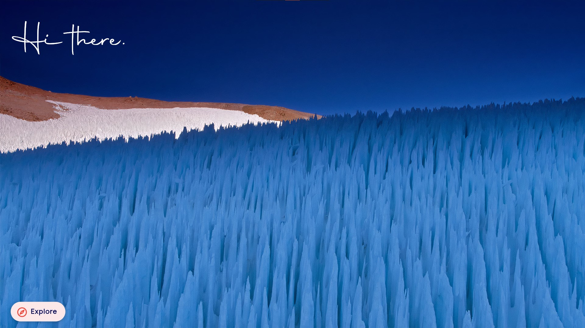
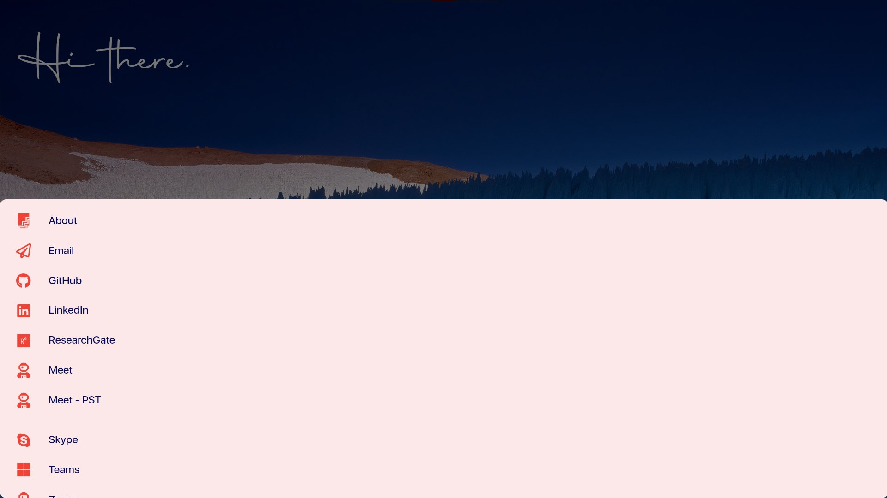

# The Raven Project
The Raven Project is my personal website, acting as a fast and convenient hub for all the different links I need to share during a group project such as Google Meet and Google Workspace project links. It's powered by Flutter, Google's UI toolkit for building beautiful, natively compiled applications for mobile, web and desktop from a single codebase.

[wenzelarifiandi.com](https://wenzelarifiandi.com)

